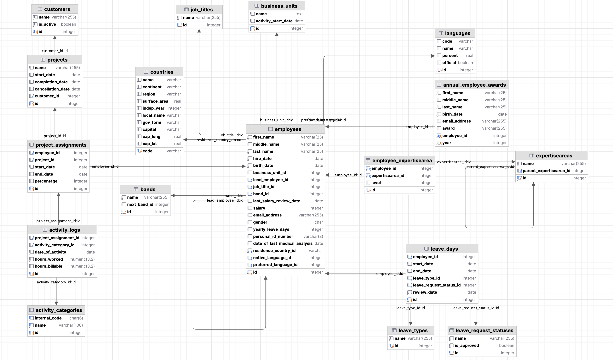
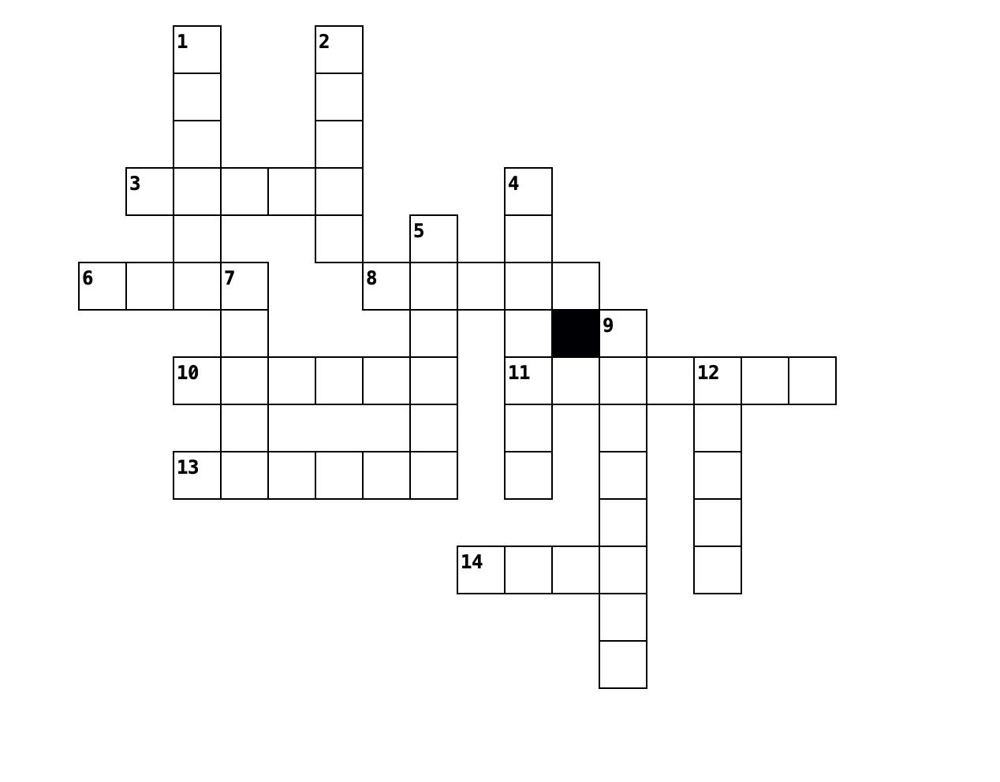

# Capstone project

The goal of the capstone project is to cover a wide array of subjects that have been addressed in the learning sessions.   
While it may initially seem daunting, I am confident that as you delve into the assignments, you will find them captivating and enjoyable, 
offering yet another excellent opportunity to apply the skills you've developed throughout the learning sessions.  
As highlighted in the course announcement, the capstone project involves a fulfilling commitment of up to 6 hours of work.

**Table of Contents**:

<!-- TOC -->
* [Capstone project](#capstone-project)
* [1. Project description](#1-project-description)
* [2. Dedicated schema](#2-dedicated-schema)
* [3. Assignments](#3-assignments)
  * [3.1 Warm-up](#31-warm-up)
    * [3.1.1 Working with a single table](#311-working-with-a-single-table)
    * [3.1.2 Doing some counting while still working with a single table](#312-doing-some-counting-while-still-working-with-a-single-table)
    * [3.1.3 Start working with multiple tables](#313-start-working-with-multiple-tables)
    * [3.1.4 To use or not to use the DISTINCT keyword](#314-to-use-or-not-to-use-the-distinct-keyword)
    * [3.1.5 Show me everything about the employees' expertise](#315-show-me-everything-about-the-employees-expertise)
    * [3.1.6 Wrangling with data from multiple tables (optional)](#316-wrangling-with-data-from-multiple-tables-optional)
  * [3.2 Let us analyze some activity logs](#32-let-us-analyze-some-activity-logs)
    * [3.2.1. Zoom in on the activity logs](#321-zoom-in-on-the-activity-logs)
    * [3.2.2. Let us do some grouping and aggregation](#322-let-us-do-some-grouping-and-aggregation)
    * [3.2.3. Identify the most hard-working employees](#323-identify-the-most-hard-working-employees)
    * [3.2.4. Identify the "employees of the month"](#324-identify-the-employees-of-the-month)
    * [3.2.5. Summarize the billable hours](#325-summarize-the-billable-hours)
  * [3.3 Decode the query](#33-decode-the-query)
    * [3.3.1 Start working with worked and billable hours ratio](#331-start-working-with-worked-and-billable-hours-ratio)
    * [3.3.2 The answer is related to billable hours](#332-the-answer-is-related-to-billable-hours)
  * [3.4 Correct the mistakes intentionally introduced in the query](#34-correct-the-mistakes-intentionally-introduced-in-the-query)
    * [3.4.1 Do you like using joins?](#341-do-you-like-using-joins)
    * [3.4.2 There is always time for a subquery!](#342-there-is-always-time-for-a-subquery)
  * [3.5 Fill in the blanks](#35-fill-in-the-blanks)
    * [3.5.1 Guess more than one query section at a time](#351-guess-more-than-one-query-section-at-a-time)
    * [3.5.2 Are you ready to think about date manipulation?](#352-are-you-ready-to-think-about-date-manipulation)
  * [3.6 Manipulate the data](#36-manipulate-the-data)
    * [3.6.1 Add new rows to a table](#361-add-new-rows-to-a-table)
    * [3.6.2 Update existing rows in a table](#362-update-existing-rows-in-a-table)
    * [3.6.3 Delete existing rows from a table](#363-delete-existing-rows-from-a-table)
  * [3.7 Use the documentation](#37-use-the-documentation)
    * [3.7.1 Random Number Generation](#371-random-number-generation)
    * [3.7.2 Creating a table from a query result](#372-creating-a-table-from-a-query-result)
  * [3.8 Put your creativity to work](#38-put-your-creativity-to-work)
    * [3.8.1 Make proof of using the EXCEPT set operator](#381-make-proof-of-using-the-except-set-operator)
    * [3.8.2 Make proof of using LEFT OUTER JOIN and RIGHT OUTER JOIN](#382-make-proof-of-using-left-outer-join-and-right-outer-join)
    * [3.8.3 Make proof of WITH and GROUP BY clauses](#383-make-proof-of-with-and-group-by-clauses)
    * [3.8.4 Make proof of using correlated subqueries](#384-make-proof-of-using-correlated-subqueries)
  * [3.9 Solve SQL the crossword puzzle!](#39-solve-sql-the-crossword-puzzle)
<!-- TOC -->

# 1. Project description

The capstone project involves the widely recognized `employees` database,
which has been updated with additional tables to facilitate the creation
of more complex queries.  
While it bears resemblance to previous homework assignments, this project incorporates novel forms of assignment
structures, enhancing both its difficulty and engagement factor.

# 2. Dedicated schema

The capstone project will be conducted in a dedicated schema, named `capstone`.


# 3. Assignments

## 3.1 Warm-up

### 3.1.1 Working with a single table

Categories of expertise are stored in the `expertiseareas` table and are organised on two levels.  
List all the area of expertise that and their category of expertise in alphabetical order of the category of expertise
and then in alphabetical order of the area of expertise.

**Expected output**: 24 rows

| category\_of\_expertise     | area\_of\_expertise         |
|:----------------------------|:----------------------------|
| Business Intelligence Tools | Power BI                    |
| Business Intelligence Tools | Tableau                     |
| Cloud Platforms             | AWS                         |
| Cloud Platforms             | Azure                       |
| Cloud Platforms             | GCP                         |
| Data Governance             | Data Quality                |
| Data Governance             | Data Security               |
| Data Modeling               | Dimensional Modeling        |
| Data Modeling               | ERD Design                  |
| Data Processing Frameworks  | Apache Spark                |
| Data Processing Frameworks  | Hadoop                      |
| Data Visualization          | Matplotlib                  |
| Data Visualization          | Seaborn                     |
| Data Warehousing            | Amazon Redshift             |
| Data Warehousing            | Google BigQuery             |
| Data Warehousing            | Snowflake                   |
| Machine Learning            | Deep Learning               |
| Machine Learning            | Natural Language Processing |
| Machine Learning            | Supervised Learning         |
| Machine Learning            | Unsupervised Learning       |
| Programming Languages       | Java                        |
| Programming Languages       | Python                      |
| Programming Languages       | R                           |
| Programming Languages       | SQL                         |

```sql
-- Your solution goes here.
```

### 3.1.2 Doing some counting while still working with a single table

List the categories of area of expertise
and the number of area of expertise in each category in descending order of the number of area of expertise.
Do NOT exclude the categories of area of expertise without any area of expertise.
```sql
-- Your solution goes here.
```


**Expected output**: 10 rows  

| name                        | nr\_areas\_of\_expertise |
|:----------------------------|-------------------------:|
| Machine Learning            |                        4 |
| Programming Languages       |                        4 |
| Data Warehousing            |                        3 |
| Cloud Platforms             |                        3 |
| Data Governance             |                        2 |
| Data Visualization          |                        2 |
| Data Processing Frameworks  |                        2 |
| Business Intelligence Tools |                        2 |
| Data Modeling               |                        2 |
| Data mining                 |                        0 |

### 3.1.3 Start working with multiple tables

List the employees with `Data engineer` job title and their area of expertise in the `Programming Languages` 
area of expertise category.
Order the results by the last name and first name of the employees, then the area of expertise.
Use the `SELECT id, name FROM expertiseareas WHERE name = 'Programming Languages'` query to get the id of 
the area of expertise category.  
Use the `SELECT id FROM job_titles WHERE name = 'Data engineer'` query to get the id of the job title.

```sql
-- Your solution goes here.
```

**Expected output**: 4 rows

|   id | last\_name | first\_name | category\_of\_expertise | area\_of\_expertise |
|-----:| :--- | :--- | :--- | :--- |
|   23 | Kiss | Ferenc | Programming Languages | Java |
|    6 | Kovacs | Andras | Programming Languages | Python |
|    6 | Kovacs | Andras | Programming Languages | Scala |
|   11 | Kovacs | Anna | Programming Languages | SQL |


### 3.1.4 To use or not to use the DISTINCT keyword

Arrange in alphabetical order the ids, last names, and first names of employees
who possess at least one area of expertise within the "Programming Languages"
category, as assigned in the employee_expertisearea table.  
Use the `SELECT id FROM expertiseareas WHERE name = 'Programming Languages'` query to get the id of the category.

**Remarks**:  
(A) one employee can have multiple areas of expertise assiged to him/her
from the "Programming Languages" category (`see employee with the employees.id=6`).
If your solution returns the same employee multiple times, you should try to remove the duplicates:
 1. using the DISTINCT keyword
 2. using the GROUP BY clause (and CTE for the intermediate results)

```sql
-- Your solution goes here.
```

**Expected output**: 7 rows

| id | last\_name | first\_name |
| :--- | :--- | :--- |
| 2 | Kiss | Istvan |
| 6 | Kovacs | Andras |
| 7 | Molnar | Anita |
| 11 | Kovacs | Anna |
| 12 | Toth | Balazs |
| 21 | Kovacs | Gabor |
| 23 | Kiss | Ferenc |


### 3.1.5 Show me everything about the employees' expertise
Show me the ids, last names, first names, category of expertise, and area of expertise of all employees.  
Order the results by the last name and first name of the employees, then the category of expertise, and then the area 
of expertise.

```sql
-- Your solution goes here.
```

**Expected output**: 38 rows

|  id | last\_name | first\_name | category\_of\_expertise     | area\_of\_expertise         |
|----:|:-----------|:------------|:----------------------------|:----------------------------|
|   4 | Horvath    | Eva         | Data Governance             | Data Quality                |
|   4 | Horvath    | Eva         | Data Visualization          | Seaborn                     |
|   4 | Horvath    | Eva         | Machine Learning            | Supervised Learning         |
|  16 | Kiss       | Eva         | Business Intelligence Tools | Tableau                     |
|  16 | Kiss       | Eva         | Data Visualization          | Matplotlib                  |
|  23 | Kiss       | Ferenc      | Data Governance             | Data Quality                |
|  23 | Kiss       | Ferenc      | Data Processing Frameworks  | Apache Spark                |
|  23 | Kiss       | Ferenc      | Data Visualization          | Matplotlib                  |
|  23 | Kiss       | Ferenc      | Data Warehousing            | Snowflake                   |
|  23 | Kiss       | Ferenc      | Programming Languages       | Java                        |
|   2 | Kiss       | Istvan      | Data Warehousing            | Google BigQuery             |
|   2 | Kiss       | Istvan      | Programming Languages       | Java                        |
| ... | ...        | ...         | ...                         | ...                         |
|  12 | Toth       | Balazs      | Data Warehousing            | Snowflake                   |
|  12 | Toth       | Balazs      | Programming Languages       | Java                        |
|   9 | Toth       | Lilla       | Data Visualization          | Matplotlib                  |
|   9 | Toth       | Lilla       | Machine Learning            | Natural Language Processing |
|  19 | Varga      | Laszlo      | Business Intelligence Tools | Tableau                     |
|  19 | Varga      | Laszlo      | Data Visualization          | Seaborn                     |


### 3.1.6 Wrangling with data from multiple tables (optional)
See the complete expertise of the employees who
have at least one or more expertise from have any expertise from the "Data Warehousing" category
but do not have simultaneously expertises from both the "Programming Languages" and "Data Visualization" categories.
Order the results by the last name and first name of the employees, then the category of expertise, 
and then the area of expertise. 

Remarks:  
  - difficulty level: high (in the context of this course)
  - this task is optional, but it is a good exercise to practice the use set operators

**Expected output**: 12 rows

| id | last\_name | first\_name | category\_of\_expertise | area\_of\_expertise |
| :--- | :--- | :--- | :--- | :--- |
| 2 | Kiss | Istvan | Data Warehousing | Google BigQuery |
| 2 | Kiss | Istvan | Programming Languages | Java |
| 11 | Kovacs | Anna | Data Governance | Data Quality |
| 11 | Kovacs | Anna | Data Processing Frameworks | Hadoop |
| 11 | Kovacs | Anna | Data Warehousing | Google BigQuery |
| 11 | Kovacs | Anna | Programming Languages | SQL |
| 21 | Kovacs | Gabor | Data Warehousing | Amazon Redshift |
| 21 | Kovacs | Gabor | Programming Languages | Python |
| 7 | Molnar | Anita | Data Warehousing | Amazon Redshift |
| 7 | Molnar | Anita | Programming Languages | Java |
| 12 | Toth | Balazs | Data Warehousing | Snowflake |
| 12 | Toth | Balazs | Programming Languages | Java |


## 3.2 Let us analyze some activity logs

### 3.2.1. Zoom in on the activity logs
List the date of activity, hours spent on the activity, and the name of the activity category
for all the activities done by the employee with the id 11 in the month of September 2023. 
Try to write a sargable query.  
**Hint**: the `activity_logs` table contains a `project_assignment_id`, not the `employee_id`. 
To be able to filter by the `employee_id`, you need to join the `project_assignments table`.    
Projects table and activity_categories table should be joined as well.

```sql
-- Your solution goes here.
``` 

**Expected output**: 157 rows  

| date\_of\_activity | project                                                 | activity                             | hours\_worked |
|:-------------------|:--------------------------------------------------------|:-------------------------------------|--------------:|
| 2023-09-04         | BIOasis: Business Intelligence Optimization & Analytics | Data Analysis Support                |          1.00 |
| 2023-09-04         | BIOasis: Business Intelligence Optimization & Analytics | Data pipeline testing                |          1.00 |
| 2023-09-04         | BIOasis: Business Intelligence Optimization & Analytics | Data Visualization                   |          1.00 |
| 2023-09-04         | BIOasis: Business Intelligence Optimization & Analytics | Report Development                   |          5.00 |
| 2023-09-04         | NexaNode: Scalable Data Warehouse Solutions             | Data Analysis Support                |          0.50 |
| 2023-09-04         | NexaNode: Scalable Data Warehouse Solutions             | Data Modeling                        |          0.50 |
| ...                | ...                                                     | ...                                  |           ... |
| 2023-09-28 | NexaNode: Scalable Data Warehouse Solutions             | Report Development                   | 0.50 |
| 2023-09-29 | BIOasis: Business Intelligence Optimization & Analytics | Data Modeling                        | 1.00 |
| 2023-09-29 | BIOasis: Business Intelligence Optimization & Analytics | Data pipeline testing                | 3.00 |
| 2023-09-29 | BIOasis: Business Intelligence Optimization & Analytics | Query performance testing and tuning | 3.00 |
| 2023-09-29 | BIOasis: Business Intelligence Optimization & Analytics | Report Development                   | 1.00 |
| 2023-09-29 | NexaNode: Scalable Data Warehouse Solutions             | Dashboard Creation                   | 0.50 |
| 2023-09-29 | NexaNode: Scalable Data Warehouse Solutions             | Data Modeling                        | 0.50 |
| 2023-09-29 | NexaNode: Scalable Data Warehouse Solutions             | ETL Development                      | 0.50 |
| 2023-09-29 | NexaNode: Scalable Data Warehouse Solutions             | Query performance testing and tuning | 0.50 |


### 3.2.2. Let us do some grouping and aggregation
As we have seen in the results of the previous assignment, the employee with the id 11 has been very busy in September.    
List name of the activity category and the total number of hours spent on the activity category in September 2023 for the same employee with id 11.
Order the results by the total number of hours spent on the activity category in descending order.

```sql 
-- Your solution goes here.
```

**Expected output**: 8 rows

| activity | total\_hours\_worked |
| :--- |---------------------:|
| Query performance testing and tuning |                   30 |
| Report Development |                 29.5 |
| Data Analysis Support |                 28.5 |
| Data pipeline testing |                   28 |
| Data Visualization |                 27.5 |
| Data Modeling |                 23.5 |
| ETL Development |                   18 |
| Dashboard Creation |                   17 |


### 3.2.3. Identify the most hard-working employees
For the months of August 2023, September 2023, October 2023, and November 2023, 
list the name of the employee and the total number of hours spent 
on activities for each employee. 
Exclude from the list the results where the monthly total number of hours spent on activities is less than 160.  

**Expected output**: 18 rows

| id | employee | month\_of\_2023 | total\_hours\_worked |
| :--- | :--- |----------------:|---------------------:|
| 11 | Kovacs Anna |               8 |                  190 |
| 12 | Toth Balazs |               8 |                  190 |
| 4 | Horvath Eva |               8 |                  190 |
| 11 | Kovacs Anna |               9 |                  202 |
| 4 | Horvath Eva |               9 |                  200 |
| 12 | Toth Balazs |               9 |                  200 |
| 6 | Kovacs Andras |               9 |                  162 |
| 23 | Kiss Ferenc |               9 |                  161 |
| 10 | Nagy Laszlo |               9 |                  160 |
| 4 | Horvath Eva |              10 |                  221 |
| 11 | Kovacs Anna |              10 |                  221 |
| 12 | Toth Balazs |              10 |                  220 |
| 23 | Kiss Ferenc |              10 |                  180 |
| 6 | Kovacs Andras |              10 |                  177 |
| 10 | Nagy Laszlo |              10 |                  176 |
| 12 | Toth Balazs |              11 |                  192 |
| 11 | Kovacs Anna |              11 |                  191 |
| 4 | Horvath Eva |              11 |                  191 |


### 3.2.4. Identify the "employees of the month"

For the months of August 2023, September 2023, October 2023, and November 2023 
list the month index, name of the employee and the total number of hours spent 
on activities for the employees with the higher number of hours spent on activities in each month.  
Order the results by the month index in ascending order.

**Hints**: 
- you can use the `WITH` clause to create a `CTE` for the intermediate results, 
 create a CTE with the employee_ids and the total number of hours spent on activities for each employee and month
- using the CTE created in the previous step, you can create a second CTE with the month and the maximum number of hours spent on activities in each month.
- by joining the two CTEs with the employees table, you can get the name of the employees with the maximum number of hours spent on activities in each month.

**Expected output**: 7 rows  

| wmonth | employee | monthly\_hours |
|-------:| :--- |---------------:|
|      8 | Horvath Eva |            190 |
|      8 | Kovacs Anna |            190 |
|      8 | Toth Balazs |            190 |
|      9 | Kovacs Anna |            202 |
|     10 | Horvath Eva |            221 |
|     10 | Kovacs Anna |            221 |
|     11 | Toth Balazs |            192 |

### 3.2.5. Summarize the billable hours
For the month of September 2023, list the name of the customer, the name of the activity category and the 
total number of billable hours spent on activities for each customer and activity category.

**Expected output**: 16 rows  

| name | name | total\_billable\_hours |
| :--- | :--- |-----------------------:|
| GE | Data Analysis Support |                     85 |
| GE | Data Visualization |                   80.3 |
| GE | Query performance testing and tuning |                     75 |
| GE | Dashboard Creation |                   63.6 |
| GE | Report Development |                   62.1 |
| GE | Data pipeline testing |                   59.7 |
| GE | Data Modeling |                   57.3 |
| GE | ETL Development |                     57 |
| Johnson&Johnson | Dashboard Creation |                   71.4 |
| Johnson&Johnson | ETL Development |                   68.1 |
| Johnson&Johnson | Data Visualization |                   66.8 |
| Johnson&Johnson | Report Development |                   64.2 |
| Johnson&Johnson | Query performance testing and tuning |                   62.2 |
| Johnson&Johnson | Data pipeline testing |                   58.6 |
| Johnson&Johnson | Data Modeling |                   55.2 |
| Johnson&Johnson | Data Analysis Support |                   48.6 |


## 3.3 Decode the query

### 3.3.1 Start working with worked and billable hours ratio
Please describe in words what the following query does, what real-life problem it solves.
The query runs correctly on the `capstone` schema. Running the query or just sections of the query and analyzing the results
 should help you to understand the query.
```sql
WITH stat_202309 AS (SELECT SUM(hours_billable) / SUM(hours_worked) as billable_ratio
                     FROM activity_logs al
                              inner join activity_categories ac on al.activity_category_id = ac.id
                     WHERE al.date_of_activity > TO_DATE('2023-08-31', 'YYYY-MM-DD')
                       AND date_of_activity < TO_DATE('2023-10-01', 'YYYY-MM-DD')
                     GROUP BY ac.id, ac.name, EXTRACT(MONTH FROM date_of_activity))
SELECT ac.name, SUM(hours_billable) / SUM(hours_worked) as min_billable_ratio
FROM activity_logs al
         INNER JOIN activity_categories ac ON al.activity_category_id = ac.id
WHERE al.date_of_activity > TO_DATE('2023-08-31', 'YYYY-MM-DD')
  AND date_of_activity < TO_DATE('2023-10-01', 'YYYY-MM-DD')
GROUP BY ac.id, ac.name, EXTRACT(MONTH FROM date_of_activity)
HAVING SUM(hours_billable) / SUM(hours_worked) = (SELECT MIN(billable_ratio)
                                                  FROM stat_202309)
```

```markdown
Your answer goes here.
```

### 3.3.2 The answer is related to billable hours

Please describe in words what the following query does, what real-life problem it solves.
The query runs correctly on the `capstone` schema. Running the query and analyzing the results 
should help you to understand the query.

```sql
set search_path to capstone;
WITH stat_202309 AS (SELECT ac.id,
                            ac.name,
                            EXTRACT(MONTH FROM date_of_activity) as wmonth,
                            SUM(hours_billable)                  as total_billable_hours
                     FROM activity_logs al
                              inner join activity_categories ac on al.activity_category_id = ac.id
                     WHERE al.date_of_activity > TO_DATE('2023-08-31', 'YYYY-MM-DD')
                       AND date_of_activity < TO_DATE('2023-10-01', 'YYYY-MM-DD')
                     GROUP BY ac.id, ac.name, EXTRACT(MONTH FROM date_of_activity)),
     stat_202310 AS (SELECT ac.id,
                            ac.name,
                            EXTRACT(MONTH FROM date_of_activity) as wmonth,
                            SUM(hours_billable)                  as total_billable_hours
                     FROM activity_logs al
                              inner join activity_categories ac on al.activity_category_id = ac.id
                     WHERE al.date_of_activity > TO_DATE('2023-09-30', 'YYYY-MM-DD')
                       AND date_of_activity < TO_DATE('2023-11-01', 'YYYY-MM-DD')
                     GROUP BY ac.id, ac.name, EXTRACT(MONTH FROM date_of_activity))

SELECT stat_202309.name,
       stat_202309.total_billable_hours,
       stat_202310.total_billable_hours,
       stat_202309.total_billable_hours - stat_202310.total_billable_hours as diff_hours
FROM stat_202309
         INNER JOIN stat_202310 ON stat_202309.id = stat_202310.id
    AND stat_202309.total_billable_hours > stat_202310.total_billable_hours;
```
```markdown
Your answer goes here.
```

## 3.4 Correct the mistakes intentionally introduced in the query

### 3.4.1 Do you like using joins?
Show the minimum, maximum, and average age of employees in every business unit.
Omit employees who are not assigned to any business unit,
and business units that do not have any employees or the average age of their employees is greater than 30.
Order the results by the business unit's name in ascending order.

```sql
WITH age_stats AS (SELECT business_unit_id,
                          EXTRACT(YEAR FROM MAX(age(birth_date))) AS max_age,
                          EXTRACT(YEAR FROM MIN(age(birth_date))) AS min_age,
                          EXTRACT(YEAR FROM AVG(age(birth_date))) AS avg_age
                   FROM employees
                   WHERE business_unit_id IS NOT NULL
                   GROUP BY business_unit_id
                   HAVING EXTRACT(YEAR FROM AVG(age(birth_date))) <= 30)

SELECT business_units.name            as business_unit,
       COALESCE(age_stats.min_age, 0) as min_age,
       COALESCE(age_stats.max_age, 0) as max_age,
       COALESCE(age_stats.avg_age, 0) as max_age
FROM business_units
         LEFT OUTER JOIN age_stats ON business_units.id = age_stats.business_unit_id
ORDER BY business_units.name ASC;
```

If you correct the mistakes in the query, the output should be as follows:
**Expected output**: 3 rows

| business\_unit      | min\_age | max\_age | max\_age |
|:--------------------|---------:|---------:|---------:|
| Managed services    |       26 |       31 |       28 |
| Team augmentation 1 |       25 |       31 |       28 |
| Team Augmentation 2 |       25 |       38 |       30 |

### 3.4.2 There is always time for a subquery!
Fetch the full names, band classifications, salaries of employees whose earnings
are less or equal than the average salary in their respective bands.
ALso include the average salary for the band and the difference between the employee's salary and the average salary for
the band.

```sql
SELECT first_name || ' ' || last_name                                                           as full_name,
       b.name                                                                                   as band_classification,
       salary,
       (SELECT FLOOR(AVG(salary)) FROM employees e WHERE e.band_id = emp.band_id)               as avg_sal,
       ABS(salary - (SELECT FLOOR(AVG(salary)) FROM employees e WHERE e.band_id = emp.band_id)) as avg_sal_diff
FROM employees emp
         INNER JOIN bands b On emp.band_id = b.id
WHERE salary <= (SELECT AVG(salary) FROM employees e WHERE e.band_id = emp.band_id)
ORDER BY salary DESC;
```

If you correct the mistakes in the query, the output should be as follows:
**Expected output**: 14 rows

| full\_name | band\_classification | salary | avg\_sal | avg\_sal\_diff |
| :--- | :--- | :--- | :--- | :--- |
| Miklos Kovacs | Senior 1 | 3100 | 3533 | 433 |
| Bela Nagy | Junior 2 | 3100 | 3460 | 360 |
| Katalin Szabo | Senior 1 | 3000 | 3533 | 533 |
| Ferenc Kovacs | Senior 4 | 2900 | 2900 | 0 |
| Ferenc Kiss | Junior 2 | 2900 | 3460 | 560 |
| Katalin Szabo | Senior 2 | 2800 | 3500 | 700 |
| Eva Kiss | Senior 3 | 2800 | 3175 | 375 |
| Noemi Biro | Mid-Senior | 2700 | 2733 | 33 |
| Andras Kovacs | Senior 3 | 2600 | 3175 | 575 |
| Katalin Varga | Senior 2 | 2600 | 3500 | 900 |
| Gabor Nagy | Junior 1 | 2500 | 3066 | 566 |
| Gabor Nagy | Mid-Senior | 2500 | 2733 | 233 |
| Zoltan Toth | Mid-Senior | 2000 | 2733 | 733 |
| Tamas Molnar | Senior 4 | 2000 | 2900 | 900 |

Remarks: the query is not the ideal solution to the problem.  
But in this case the goal is to be able to read and understand inefficient queries as well.

## 3.5 Fill in the blanks

**Goal**: the goal of this assignment section is
reading and understanding the structure of a query, query written by someone else.

### 3.5.1 Guess more than one query section at a time

```sql
SELECT bu.name, COALESCE(__________, 0) as __________
FROM business_units bu
         LEFT OUTER JOIN (SELECT COUNT(*) nr_employees, business_unit_id
                          FROM employees
                          GROUP BY ___________) stats
                         ON (bu.id = stats.business_unit_id)
WHERE __________ IS NULL;
```

If `_________` are filled in correctly, the output should be as follows:
**Expected output**: 1 row

| name          | number\_of\_employees |
|:--------------|----------------------:|
| Generative AI |                     0 |

### 3.5.2 Are you ready to think about date manipulation?

```sql
SELECT to_____(current_date, '_________________________, YYYY') as spelled_out_date;
```

If `_________` are filled in correctly, the output should be as follows:
**Expected output**: 1 row

| spelled\_out\_date              |
|:--------------------------------|
| Tuesday, 19th of December, 2023 |

Remark: the output of the query depends on the current date. Expect a different date when you write your own solution.

## 3.6 Manipulate the data

**Goal**: the goal of this assignment section is to practice DML statements.

### 3.6.1 Add new rows to a table

1. Insert fifteen (3x5) entries into the `annual_employee_awards` table,
   distributed over the years 2021, 2022, and 2023, ensuring
   that at least one individual receives an award each year.
2. Subsequently, compose a query to identify individuals who have been recipients of awards in each of the
   years 2021, 2022, and 2023.

```sql
-- (1) Your INSERT statements go here.
```

```sql
--- (2) Your SELECT statement goes here.
```

### 3.6.2 Update existing rows in a table

Use the ```UPDATE``` statement to set the award to "3 extra vacation days" to all the employees rewarded in 2023.

```sql
-- Your UPDATE statement goes here.
```

### 3.6.3 Delete existing rows from a table

Use the ```DELETE``` statement to delete all the employees rewarded in 2021.

```sql
-- Your DELETE statement goes here.
```  

## 3.7 Use the documentation

**Goal**: the goal of this assignment section is to get you familiar with
the documentation of the RDBMS you are working with or use online
resources to use new features of the RDBMS.

### 3.7.1 Random Number Generation

Write a query to generate 100 random numbers.
Each number should be an integer. The range of these numbers should be between 1 and 100, inclusive.  
Display a list of the top 10 most frequently occurring random numbers from a set of 100 random numbers
in the descending order of their frequency.

**A possible output:** 10 rows

| random\_number | nr\_occurrence |
|---------------:|---------------:|
|              6 |              5 |
|             48 |              5 |
|             92 |              4 |
|             60 |              4 |
|             83 |              4 |
|             81 |              4 |
|             19 |              3 |
|             65 |              3 |
|             98 |              3 |
|             93 |              2 |

### 3.7.2 Creating a table from a query result

Using `CREATE TABLE ... AS` command to create a new table named `random_number_occurrences`.  
**Important Notes:**

- Table Structure: The new table random_number_occurrences will have two columns: random_number and nr_occurrence.
- Data Type: The data types of the columns in the new table will be inferred from the query.  
  In this case, random_number will likely be an integer, and nr_occurrence will also be an integer (count).
- Regeneration of Data: Each time you run this `CREATE TABLE AS` command, it will generate a new set of random numbers.
  If the table already exists, you'll get an error. To avoid this use `CREATE TABLE IF NOT EXISTS`
- (which won't overwrite the existing table) then try running the command again.

## 3.8 Put your creativity to work

**Goal**: the goal of this assignment is to get you to think about problems
in the context of the capstone schema that can be solved using specific elements of SQL.

### 3.8.1 Make proof of using the EXCEPT set operator

Formulate your own assignment and write the solver query using the EXCEPT set operator.

### 3.8.2 Make proof of using LEFT OUTER JOIN and RIGHT OUTER JOIN

Formulate your own assignment and write the solver query

1. using LEFT OUTER JOIN
2. using RIGHT OUTER JOIN

### 3.8.3 Make proof of WITH and GROUP BY clauses

Formulate your own assignment and write the solver query that creates a CTE for intermediate results.  
Employ the GROUP BY clause within the CTE or the main query.

### 3.8.4 Make proof of using correlated subqueries

Formulate your own assignment that:

1. can be solved using a correlated subquery.
2. If possible, write a second alternative query that does not use a correlated subquery.

## 3.9 Solve SQL the crossword puzzle!
Solve the SQL crossword puzzle below.



**Across:**  
3. A collection of related data in a database.  
6. A virtual table based on the result-set of an SQL statement.(check the documentation)  
8. Operator used to combine result sets.  
10. SQL command to remove records.  
11. The main key in a database table.  
13. SQL command to retrieve data.  
14. Combining rows from two or more tables.  

**Down:**  
1. SQL command to modify existing records.
2. Used to speed up searches in a database.
4. Clause used to group rows with similar values.
5. SQL command to add new records.
7. Clause used to filter records.
9. Keyword used to return unique values.
12. Command to modify an existing database object.

