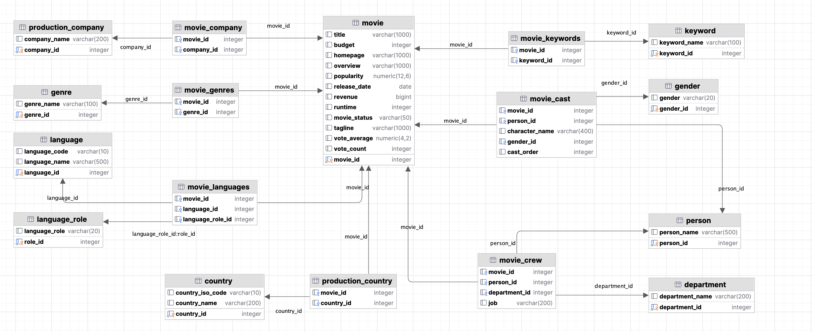

# The movies practice database

<!-- TOC -->
* [The movies practice database](#the-movies-practice-database)
  * [1. Introduction](#1-introduction)
  * [2. Table descriptions](#2-table-descriptions)
  * [3. Database diagram](#3-database-diagram)
  * [4. Data setup](#4-data-setup)
  * [5. Assignments](#5-assignments)
<!-- TOC -->

## 1. Introduction
This database contains details on movies, including the cast and crew, production locations, producing companies, and additional movie-related data like languages, genres, and keywords.

The sample data is sourced from [Database Star](https://www.databasestar.com/sample-database-movies/). It encompasses approximately 4,800 movies, 104,000 cast and crew members, and thousands of metadata entries, including languages and keywords.

## 2. Table descriptions

The `movie` table holds details about each film, including textual information like the title and overview. Some columns are self-explanatory, such as revenue (the earnings of the movie) and budget (the cost of production). Other columns, like popularity, votes_avg, and votes_count, are derived from the data used to compile the database. The status column shows whether a movie is Released, Rumoured, or in Post-Production.

The `country` list table enumerates various countries, while the `movie_country` table records the countries where a movie was shot, acknowledging that some films are shot in multiple countries. This represents a typical many-to-many relationship, a common feature in numerous databases.

This concept is similarly applied in the `production_company` table, which lists production companies and their many-to-many relationships with movies, as recorded in the `movie_company` table.

The `language`s table lists different languages, and the movie_languages table tracks the languages used in a movie. A unique aspect here is the `language_role` table, which includes two types of records: `Origina`l and `Spoken`. A film may have one original language (like English) but several spoken languages, which are noted in the movie_languages table along with their roles.

`Genre`s categorize movies into types, such as `Comedy` or `Horror`. Since a movie can belong to multiple genres, this is captured in the `movie_genres` table.

A similar approach is used for `keyword`s, which are more varied and numerous than `genre`s. Keywords might include terms like “paris”, “gunslinger”, or “saving the world”, and their exploration can offer insights into the data.

The cast and crew section is somewhat more complex. Actors, actresses, and crew members are all listed in the `person` table, which includes each individual's name.

The `movie_cast` table logs each `person`'s role in a movie as a cast member, including their character name and `cast_order`, which presumably indicates their prominence in the cast list.

Additionally, the movie_cast table is linked to the gender table to denote the gender of each character. This link is made with the movie_cast table rather than the person table to accommodate characters whose gender differs from the actor or is unspecified. Therefore, there is no direct gender table linked to the person table, a decision influenced by the nature of the sample data.

The `movie_crew` table mirrors this structure for crew members, detailing their specific jobs within various departments, such as Camera.

## 3. Database diagram

## 4. Data setup
If you're interested in setting up your own schema with the movie and related tables, you can execute the scripts compiled in the [`movies.zip`](data_setup/movies.zip) file.

## 5. Assignments
I have created a set of intriguing exercises in the [optional_assignment_movies.md](assignments/optional_assignment_movies.md) file. By completing these exercises, 
you have the opportunity to earn an additional 1.5 points.
