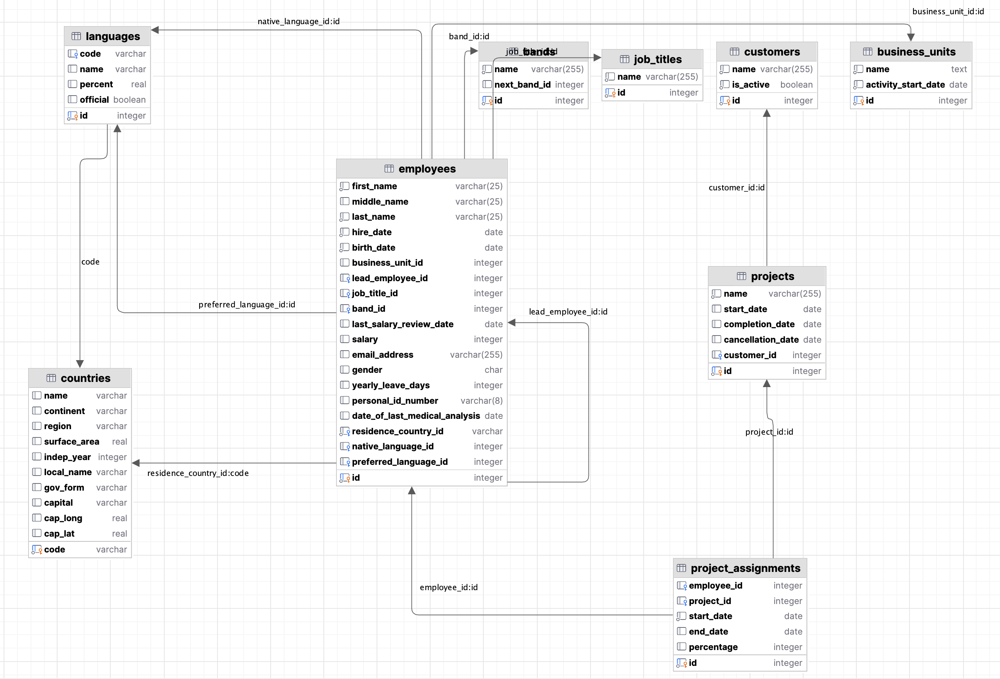

# Learning session 4

<!-- TOC -->
* [Learning session 4](#learning-session-4)
  * [Topics Overview](#topics-overview)
  * [Data setup](#data-setup)
  * [Homework assignment](#homework-assignment)
<!-- TOC -->

## Topics Overview
In our fourth session, we will dive deep into the intricate world of **subqueries**, 
a powerful tool in database management and querying.  
`Subqueries`, often nestled within a larger query, can be both correlated and non-correlated, 
each with its unique characteristics and applications. 
We'll explore how to `embed subqueries within various segments of a SQL statement`, 
including the WHERE clause, FROM clause, and even within INNER JOINs.  
Additionally, we'll demystify the concept of `derived tables` and 
their role in optimizing database operations. 
To ensure you're equipped with a holistic understanding, 
we'll also discuss the best scenarios for employing subqueries and, equally important, 
situations where their use might not be the most efficient approach. 

## Additional information
If you would like to discover what columns of the ```employees``` table are 
referencing columns from other tables, you can use the following query:

```postgresql
SELECT
    conname AS constraint_name,
    conrelid::regclass AS table_name,
    a.attname AS column_name,
    confrelid::regclass AS foreign_table_name,
    af.attname AS foreign_column_name
FROM
    pg_constraint c
JOIN
    pg_attribute a ON a.attnum = ANY(c.conkey) AND a.attrelid = c.conrelid
JOIN
    pg_attribute af ON af.attnum = ANY(c.confkey) AND af.attrelid = c.confrelid
WHERE
    conrelid = 'employees'::regclass;
```
You should get a result similar to the following:

|constraint_name|table_name|column_name|foreign_table_name|foreign_column_name|
|----------------------|----------------------|----------------------|----------------------|----------------------|
|employees_band_id_fkey|employees|band_id|bands|id|
|employees_job_title_id_fkey|employees|job_title_id|job_titles|id|
|employees_lead_employee_id_fkey|employees|lead_employee_id|employees|id|
|employees_native_language_id_fkey|employees|native_language_id|languages|id|
|employees_preferred_language_id_fkey|employees|preferred_language_id|languages|id|
|employees_residence_country_id_fkey|employees|residence_country_id|countries|code|

If you prefer using diagrams to discover how tables are related, you can use this one:



## Data setup
The tables related to this learning session were created in the ```practice_04``` schema using the script
[`create_tables_practice_04.sql`](data_setup/create_tables_practice_04.sql).  
Tables were populated with data using the script 
[`populate_tables_practice_04.sql`](data_setup/populate_tables_practice_04.sql).
You can use these scripts to create the tables and populate them with data in your own local database.

## Homework assignment
The homework assignment for this session in Markdown format can be found in the
[homework_assignment_04.md](assignments/homework_assignment_04.md) file and must be submitted prior to the next session.