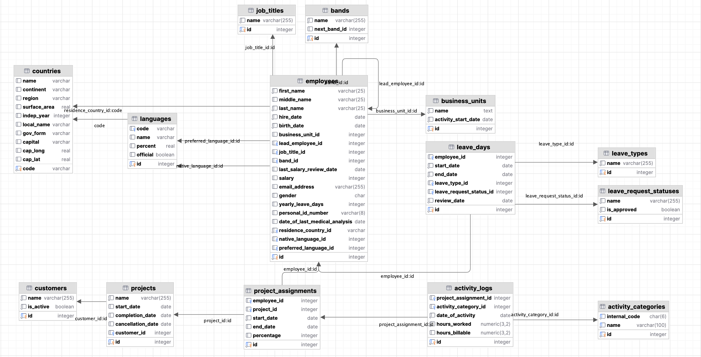

# Learning session 6

Welcome to the 6th learning session of our **SQL Essentials** course!  
In this session Today we will explore the world of set operators, a fundamental tool that allows us to 
seamlessly combine the results of multiple SQL queries.  

<!-- TOC -->
* [Learning session 6](#learning-session-6)
  * [6.1 Topics Overview](#61-topics-overview)
  * [6.2 Additional information](#62-additional-information)
  * [6.3 Data setup](#data-setup)
  * [6.4 Homework assignment](#homework-assignment)
<!-- TOC -->


## 6.1 Topics Overview
 Set operators enable us to perform operations such 
as union, intersection, and difference on datasets, unlocking the ability to extract valuable insights and 
solve complex data challenges efficiently. As we delve into the realm of set operators, you'll discover how to 
merge, compare, and transform data from various tables, paving the way for more advanced query building and data 
analysis techniques.

## 6.2 Additional information
If you would like to discover what columns of the ```employees``` table are 
referencing columns from other tables, you can use the following query:

```postgresql
SELECT
    conname AS constraint_name,
    conrelid::regclass AS table_name,
    a.attname AS column_name,
    confrelid::regclass AS foreign_table_name,
    af.attname AS foreign_column_name
FROM
    pg_constraint c
JOIN
    pg_attribute a ON a.attnum = ANY(c.conkey) AND a.attrelid = c.conrelid
JOIN
    pg_attribute af ON af.attnum = ANY(c.confkey) AND af.attrelid = c.confrelid
WHERE
    conrelid = 'employees'::regclass;
```
You should get a result similar to the following:

|constraint_name|table_name|column_name|foreign_table_name|foreign_column_name|
|----------------------|----------------------|----------------------|----------------------|----------------------|
|employees_band_id_fkey|employees|band_id|bands|id|
|employees_job_title_id_fkey|employees|job_title_id|job_titles|id|
|employees_lead_employee_id_fkey|employees|lead_employee_id|employees|id|
|employees_native_language_id_fkey|employees|native_language_id|languages|id|
|employees_preferred_language_id_fkey|employees|preferred_language_id|languages|id|
|employees_residence_country_id_fkey|employees|residence_country_id|countries|code|

If you prefer using diagrams to discover how tables are related, you can use this one:



## 6.3 Data setup
The tables related to this learning session were created in the ```practice_06``` schema using the script
[`create_tables_practice_06.sql`](data_setup/create_tables_practice_06.sql).  
Tables were populated with data using the script 
[`populate_tables_practice_06.sql`](data_setup/populate_tables_practice_06.sql).
You can use these scripts to create the tables and populate them with data in your own local database.

## 6.4 Homework assignment
The homework assignment for this session in Markdown format can be found in the
[homework_assignment_06.md](assignments/homework_assignment_06.md) file and must be submitted prior to the next session.
